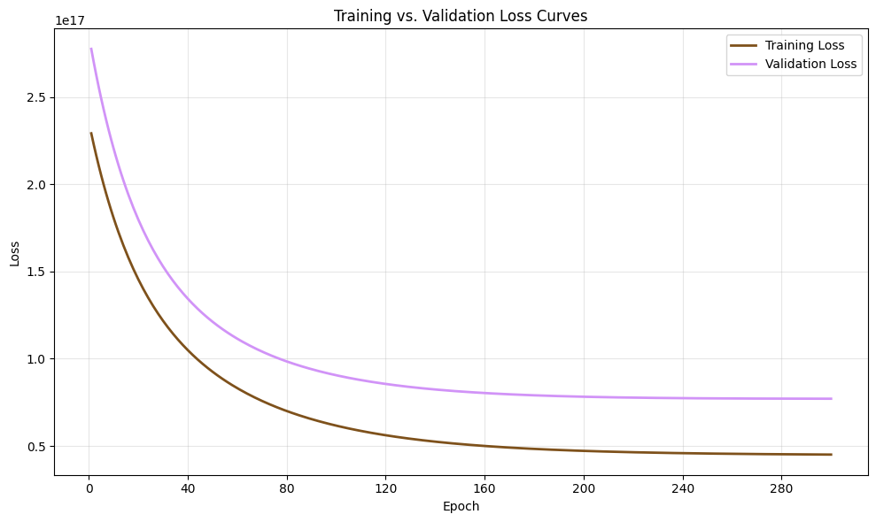
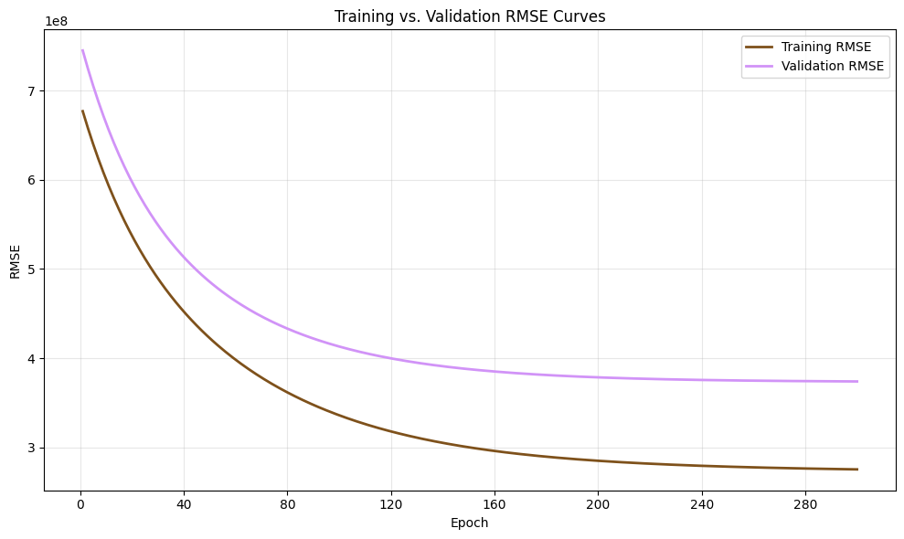

# Machine Learning From Scratch

This project implements a ridge regression model from scratch, optimized using batch gradient descent, to predict the number of streams a Spotify song receives based on its attributes. The model uses a combination of audio features, such as danceability, valence, and energy, along with indicators of playlist and chart presence. The report below details the data preprocessing steps, model design and training procedure, and evaluates performance through quantitative metrics and bias–variance analysis. It concludes with reflections on the challenges encountered and lessons learned during development. 

## 1 Data Preprocessing
After loading and inspecting the [*Most Streamed Spotify Songs 2023*](https://www.kaggle.com/datasets/nelgiriyewithana/top-spotify-songs-2023) dataset, several preprocessing steps were applied to prepare the data for regression modeling. Attributes with high cardinality or near-unique values—such as track names and artist identifiers—were removed, as they do not provide meaningful numerical signal and would inflate model complexity without improving predictive performance. Release date information was consolidated into a single numeric feature, `days_since_release`, and all remaining attributes were converted to numeric form. Rows containing missing values were discarded to maintain a complete and consistent feature set, reducing the dataset from 953 initial samples to 902 usable instances.
The cleaned dataset was split into training, validation, and test sets using an 80/10/10 ratio. Feature scaling was applied using z-score normalization computed from the training set, and a bias term was added to the input matrix to allow the model to learn an intercept.

Although the target variable—number of streams—exhibited skew and extreme values, no explicit outlier removal was performed, as these observations reflect genuine popularity effects rather than noise. This variability was instead addressed through model regularization during training.

## 2 Model Design and Training Pipeline
Ridge regression was selected to model the relationship between song attributes and stream counts due to its ability to control overfitting and mitigate multicollinearity through L2 regularization. The model minimizes the ridge loss function using batch gradient descent, with regularization applied to all weights except the bias term.

To select an appropriate regularization strength, the model was trained across multiple values of the regularization parameter $\lambda$. Initial experiments used 2,000 training iterations; however, both training and validation loss converged substantially earlier. The number of iterations was therefore reduced to 300 to avoid unnecessary fitting. Based on validation performance, $\lambda=0.1$ was selected as the final regularization parameter.

Training and validation loss and RMSE were tracked to assess convergence and training–validation error behavior, with the resulting learning curves presented in the following section. The final ridge regression model was trained on the combined training and validation set and evaluated on the held-out test set.

## 3 Results and Analysis

### 3.1 Performance Evaluation

The final ridge regression model achieved a test mean squared error (MSE) of $6.86\times10^{16}$ and a root mean squared error (RMSE) of $2.62\times10^8$. An RMSE of this magnitude indicates that, on average, predictions deviate from the true stream counts by approximately 262 million streams. While this error is large in absolute terms, it reflects the extreme scale and skew of the target variable, where stream counts span several orders of magnitude. Moreover, this performance represents a substantial improvement over a baseline predictor that assigns the mean stream count to all samples. The baseline model achieved an MSE of $3.09\times10^{17}$ and an RMSE of $5.56\times 10^{8}$, demonstrating that the ridge regression model reduced error by nearly an order of magnitude in MSE and by approximately half in RMSE.

To further examine model behavior during training, loss and RMSE were tracked on both the training and validation sets across iterations. Figure 1 shows the training and validation loss curves, while Figure 2 presents the corresponding RMSE curves. These plots illustrate the model’s convergence behavior and training–validation error patterns relevant to the bias–variance trade-off.

<figure style="text-align: center;">
  
  <figcaption>Figure 1: Training and validation loss across epochs.</figcaption>
</figure>

<figure style="text-align: center;">
  
  <figcaption>Figure 2: Training and validation RMSE across epochs.</figcaption>
</figure>

### 3.2 Bias–Variance Analysis

Inspection of the learning curves reveals that both training and validation error plateau at relatively high values with a small, stable gap between them, a pattern characteristic of a high-bias regime. This indicates that the linear model is unable to fully capture the underlying relationship between song attributes and stream counts, while the absence of a widening training–validation gap suggests that overfitting is limited. Consequently, performance appears constrained primarily by model capacity rather than variance, which is expected for a task driven by complex, nonlinear popularity dynamics under a linear modeling framework.

### 3.3 Model Selection

Model selection was guided by validation performance and learning curve behavior. Ridge regression was chosen to control overfitting through L2 regularization, and training was limited to the point of convergence to avoid unnecessary fitting. Together, these choices resulted in a configuration that generalizes consistently across data splits, as evidenced by the stable alignment between training and validation error.

## 4 Reflections
A key challenge in this project was resisting the urge to overengineer the model in pursuit of optimal performance. Given the variability and scale of the target variable, it quickly became clear that pursuing the “perfect” model was unrealistic. Progress instead came from testing reasonable choices, observing their behavior, and accepting that improvement in machine learning is incremental rather than exact. 

Implementing the full training pipeline from scratch also exposed practical details often hidden by high-level libraries. Writing the optimization and preprocessing logic directly in NumPy and Pandas made errors, scaling issues, and convergence behavior immediately visible, leading to a more concrete understanding of how implementation choices affect model behavior.

## 5 References
- [https://www.baeldung.com/cs/ml-underfitting-overfitting](https://www.baeldung.com/cs/ml-underfitting-overfitting)
- [https://codingnomads.com/validation-learning-curve-overfitting-and-underfitting](https://codingnomads.com/validation-learning-curve-overfitting-and-underfitting)
- [https://www.geeksforgeeks.org/machine-learning/implementation-of-ridge-regression-from-scratch-using-python/](https://www.geeksforgeeks.org/machine-learning/implementation-of-ridge-regression-from-scratch-using-python/)
